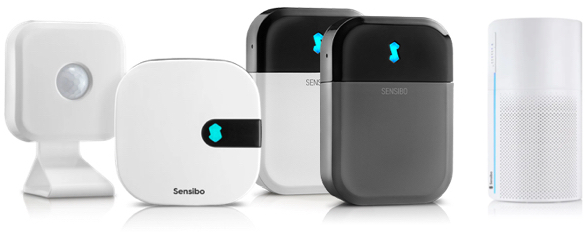

# homebridge-sensibo-ac


[](https://www.npmjs.com/package/homebridge-sensibo-ac) [](https://www.npmjs.com/package/homebridge-sensibo-ac)

[](https://github.com/homebridge/homebridge/wiki/Verified-Plugins) [](https://discord.gg/yguuVAX)

[](https://plugins.hoobs.org?ref=10876) [](https://support.hoobs.org?ref=10876)

[Homebridge](https://github.com/homebridge/homebridge) plugin for Sensibo - Smart AC Controller and Air Purifier



## Requirements


Check with: `node -v` & `homebridge -V` and update if needed

## Plugin Unique Features

- Login with **username & password** or **API-key**
- **Sensibo Sky Support**
- **Sensibo Air Support** including the attached **Room Sensors**
- **Sensibo Air Plus Support** including air quality and CO2
- **Pure Support (Air Purifier)** control, including fan speed and boost control, via a separate accessory
- **Auto Detect Configurations** - Automatically detect all your devices and their capabilities and opens up only the options available in Sensibo app to be controlled in HomeKit. More details below
- Accessory type **HeaterCooler** - allowing adjusting fan speed (Rotation Speed) & swing (Oscillate) from within the accessory in "Home" App
- **Fan Mode** control, including fan speed and swing control, via a separate accessory
- **Dry Mode** control, including fan speed and swing control, via a separate accessory
- **Horizontal Swing** - allows you to enable/disable horizontal swing of your AC
- **Vertical Swing** - allows you to enable/disable vertical swing of your AC
- **AC Sync Button** - easily toggle the state of the AC between ON/OFF in case your AC is out of sync with HomeKit (does not send commands to the AC)
- **Occupancy Sensor** - get the Home/Away status from Sensibo API to HomeKit via Occupancy sensor
- **Enable/Disable Climate React** - enable/disable Climate React. Note: It is currently not possible to change settings, on/off only
- **Filter Cleaning Indication** - if available in your Sensibo account (via Plus etc), a HomeKit representation of the Filter status will appear in Home app accessories
- **History Storage** - toggle on storing of temperature and humidity measurements and will present them in Eve app as a graph

## Installation

This plugin is Homebridge verified and HOOBS certified and can be easily installed and configured through their UI.

If you don't use Homebridge UI or HOOBS, or if you want to know more about the plugin features and options, keep reading...

1. Install homebridge using: `sudo npm install -g homebridge --unsafe-perm`
2. Install this plugin using: `sudo npm install -g homebridge-sensibo-ac`
3. Update your configuration file. See `config-sample.json` in this repository for a sample.

\* install from git: `sudo npm install -g git+https://github.com/nitaybz/homebridge-sensibo-ac.git`

### Config file

#### Easy config (required)

```json
"platforms": [
    {
        "platform": "SensiboAC",
        "username": "******@*******.***",
        "password": "*******"
    }
]
```

#### Advanced config (optional)

```json
"platforms": [
    {
        "platform": "SensiboAC",
        "apiKey": "***************",
        "allowRepeatedCommands": false,
        "carbonDioxideAlertThreshold": 1500,
        "disableAirQuality": false,
        "disableCarbonDioxide": false,
        "disableDry": false,
        "disableFan": false,
        "disableHorizontalSwing": false,
        "disableHumidity": false,
        "disableLightSwitch": false,
        "disableVerticalSwing": false,
        "enableClimateReactSwitch": true,
        "enableHistoryStorage": true,
        "enableOccupancySensor": true,
        "enableSyncButton": true,
        "syncButtonInAccessory": false,
        "externalHumiditySensor": false,
        "devicesToExclude": [],
        "ignoreHomeKitDevices": false,
        "locationsToInclude": [],
        "modesToExclude": [],
        "debug": false,
        "climateReactSwitchInAccessory": false,
        "enableClimateReactAutoSetup": false,
    }
]
```

### Configurations Table

See below the table for additional details on these settings.

|          Parameter         |                       Description                                | Required |  Default |   type   |
| -------------------------- | ---------------------------------------------------------------- |:--------:|:--------:|:--------:|
| `platform`                 |  Always "SensiboAC"                                              |     ✓    | `SensiboAC` |  String  |
| `apiKey`                   |  Your Sensibo account API key (can be used instead of username/password)    |     ✓*   |     -    |  String  |
| `username`                 |  Your Sensibo account username/email                             |     ✓*   |     -    |  String  |
| `password`                 |  Your Sensibo account password                                   |     ✓*   |     -    |  String  |
| `allowRepeatedCommands`    |  Allow the plugin to send the same state command again           |          |  `false` |  Boolean |
| `carbonDioxideAlertThreshold` |  Value, in PPM, over which the Apple Home app will alert you to high CO2 readings. Requires the Carbon Dioxide Sensor be enabled  |          |  `1500` |  Integer |
| `disableAirQuality`        |  When set to `true`, will remove Air Quality and TVOC readings   |          |  `false` |  Boolean |
| `disableCarbonDioxide`     |  When set to `true`, will remove Carbon Dioxide readings and warnings       |          |  `false` |  Boolean |
| `disableDry`               |  When set to `true`, will remove the DRY accessory               |          |  `false` |  Boolean |
| `disableFan`               |  When set to `true`, will remove the FAN accessory               |          |  `false` |  Boolean |
| `disableHumidity`          |  When set to `true`, will remove Current Relative Humidity readings from the AC / Heat Pump Accessory  |          |  `false` |  Boolean |
| `disableLightSwitch`       |  When set to `true`, will remove the extra light bulb to control the AC Light  |          |  `false` |  Boolean |
| `disableHorizontalSwing`   |  When set to `true`, will remove the horizontal swing switch     |          |  `false` |  Boolean |
| `disableVerticalSwing`     |  When set to `true`, will remove the vertical swing control (Oscillate switch) from the Accessory  |          |  `false` |  Boolean |
| `enableClimateReactSwitch` |  Adds a switch to enable/disable Climate React                   |          |  `false` |  Boolean |
| `enableHistoryStorage`     |  When set to `true`, all measurements (temperature & humidity) will be saved and viewable from the Eve app  |          |  `false` |   Boolean |
| `enableOccupancySensor`    |  Adds an occupancy sensor to represent the state of someone at home         |          |  `false` |  Boolean  |
| `enableSyncButton`         |  When set to `true`, adds a **AC Sync Switch** to toggle the state of the AC in Home app, without sending a command to the unit  |          |  `false` |  Boolean  |
| `syncButtonInAccessory`    |  When set to `true`, adds an **AC Sync Switch** (like `enableSyncButton` above) but within the AC Accessory. It will also remove the standalone Sync Switch (if one exists)  |          |  `false` |  Boolean  |
| `externalHumiditySensor`   |  Creates a separate Humidity sensor accessory, ignores the `disableHumidity` setting  |          |  `false` |  Boolean |
| `devicesToExclude`         |  Add devices identifier (room name, ID from logs or serial from Home app) to exclude from homebridge  |          |     -    |  String[]  |
| `ignoreHomeKitDevices`     |  Automatically ignore, skip or remove HomeKit supported devices  |          |  `false` |  Boolean |
| `locationsToInclude`       |  Device location IDs or names to include when discovering Sensibo devices (leave empty for all locations)  |          |     -    |  String[]  |
| `modesToExclude`           |  Modes to exclude from Home app when setting up Sensibo devices (leave empty to keep all available modes). Valid values: AUTO, COOL, DRY, FAN, HEAT  |          |     -    |  String[]  |
| `debug`                    |  When set to `true`, the plugin will produce extra logs for debugging purposes  |          |  `false` |  Boolean  |
| `climateReactSwitchInAccessory`         |  When set to `true`, adds a **Climate React Button** (like `enableClimateReactSwitch` above) but within the AC Accessory. It will also remove the standalone AC Climate React switch (if one exists). Works only when `enableClimateReactSwitch` is also set to true  |          |  `false` |  Boolean  |
| `enableClimateReactAutoSetup` |  When set to `true`, the plugin (whenever the AC state is set or changed) will update the Climate React configuration to match the new settings  |          |  `false` |  Boolean  |

\* *only apiKey OR username / password are required, not both*

## Advanced Control

### Auto Detect Configurations

The plugin will scan for all your devices and retrieve each device capabilities separately. Therefore in HomeKit you will see only the things that the Sensibo app allows you to control, based on your AC units remote capabilities.

In practice:

- Minimum and Maximum temperatures are taken from Sensibo API
- Temperature unit (Celsius/Fahrenheit) is taken from Sensibo API
- "AUTO" mode is available in the AC states in HomeKit only if it is available in Sensibo app
- Modes "FAN" and "DRY" (dehumidifier) will create their own accessories only if you have this ability inside Sensibo app
- Fan Speed ("Rotation Speed" in Home app) and Vertical Swing ("Oscillate" in Home app) will show in the Accessory settings, but only if you have this capability in Sensibo app
- Horizontal Swing capability in Sensibo app will show up as a normal switch in HomeKit (because there is no other way to control horizontal swing at the moment)
- use `"ignoreHomeKitDevices": true` to automatically ignore, skip or remove HomeKit supported devices like Sensibo Air and Sensibo Pure.

### State Polling

The accessory state will be updated in the background every 90 seconds, this is hard coded and requested specifically by Sensibo company. The state will also refresh every time you open the "Home" app or any related HomeKit app.

### Disabling AC modes

If desired, you can choose to hide AC modes from the Apple Home app, preventing you from changing the unit to that mode.

To disable a mode, add `"modesToExclude": ["MODE_TO_HIDE","ANOTHER_MODE_TO_HIDE"]` to your config. Valid values are: `AUTO, COOL, DRY, FAN & HEAT`.

*Note: Including `DRY` or `FAN` in `modesToExclude` will ignore the `disableDry` and `disableFan` settings.*

### Dry Mode

If your Sensibo app can control your AC **DRY** mode, the plugin will create extra dehumidifier accessory in HomeKit to control the DRY mode of your device. It will also include all the fan speeds and swing possibilities you have for DRY mode.

To disable the extra dehumidifier accessory, add `"disableDry": true` to your config. `modesToExclude` will overwrite this setting.

***This setting will be deprecated, please use `modesToExclude` instead***

### Fan Mode

If your Sensibo app can control your AC **FAN** mode, this plugin will create extra fan accessory in HomeKit to control the FAN mode of your device. It will also include all the fan speeds and swing possibilities you have for FAN mode.

To disable the extra fan accessory, add `"disableFan": true` to your config. `modesToExclude` will overwrite this setting.

***This setting will be deprecated, please use `modesToExclude` instead***

### Auto & Fan speeds

Fan speed steps are determined by the steps you have available in the Sensibo app. Since HomeKit control over fan speed is with a slider between 0-100, the plugin converts the steps you have in the Sensibo app to values between 1 to 100, when 100 is highest and 1 is lowest. If "AUTO" speed is available in your setup, setting the fan speed to 0, will set the unit to "AUTO" speed.

### Horizontal Swing

If your Sensibo app has **Horizontal Swing** control, the plugin will create an extra switch accessory in HomeKit to control it.

To disable the extra horizontal swing switch accessory, add `"disableHorizontalSwing": true` to your config.

### Vertical Swing

If your Sensibo app has **Vertical Swing** control, the plugin will add a switch to the existing AC accessory in the Home app to control it.

To disable the extra vertical swing (oscillate) switch, add `"disableVerticalSwing": true` to your config.

Note: Due to Homebridge and Apple Home app caching you may need to manually remove the AC accessory to see the change. See [Issue #90](https://github.com/nitaybz/homebridge-sensibo-ac/issues/90) for details. For details on how to remove an Accessory take a look at the steps in [Troubleshooting and Debug](#troubleshooting-and-debug) below.

### AC Sync Button

- Does Sensibo shows your AC is ON while it's actually OFF?
- Does your sensibo state get out of sync with your AC?
- Do you find yourself changing commands from the original remote just for the AC and Sensibo to be in sync?

If you have ever found yourself struggling with the above, this feature is exactly for you! It allows you to toggle the state in Sensibo and Home app without changing the real state of your device, this will help you to sync between them.

When enabled, an additional switch accessory will be added. The switch is stateless, which means that when clicked, it turns back OFF after 1 second. Behind the scenes, the plugin toggles the state of the device from ON to OFF (or the other way around, depending on the current state of the device), without sending actual commands to the AC.

*This maybe be required if your AC has the same command for ON and OFF because it can go out of sync easily.*

To enable the extra **AC Sync** switch, add `"enableSyncButton": true` to your config.

To attach the **AC Sync** switch as a service within the AC accessory, instead of a separate switch, add `"syncButtonInAccessory": true` to your config.

Note: Setting `"syncButtonInAccessory": true` by itself will create the switch, regardless of `enableSyncButton` value.

### Occupancy Sensor

Enabling this feature will add **Occupancy Sensor** to HomeKit, representing the Home/Away state of the geofence feature in Sensibo app.

Note: Geofencing must be enabled in Sensibo app for it to work

To enable the extra **Occupancy Sensor**, add `"enableOccupancySensor": true` to your config.

### Climate React Switch

When enabled, an additional switch accessory will be added. The switch will enable or disable the "Climate React" mode you've set up in the Sensibo app.

Use this feature in conjunction with the occupancy sensor and you'll be able to get the "Sensibo Plus" feature that allows turning it on/off according to your geolocation.

Note: This feature does not allow changing the actual logic (temperature, mode etc) of the "Climate React" mode, only enabling or disabling it. Therefore, it will not work if the "Climate React" was not set up in Sensibo app first.

To enable the **Climate React switch**, add `"enableClimateReactSwitch": true` to your config.

To attach the **Climate React switch** as a service within the AC accessory, instead of a separate switch, also add `"climateReactSwitchInAccessory": true` to your config.

### Climate React Auto Setup
When enabled, every time an AC's state is set or changed, the Climate React configuration will be updated such that the desired temperature is maintained.

For example, if setting an AC to Cool to 25C, Climate React will be set up such that when the temperature rises above 25C the AC starts to cool and when the temperature drops below 24 (the target temperature minus 1 degree C, or the equivalent F delta), the AC will be turned off.

When setting an AC to Heat with a target temprature, Climate React will be set up similarly.

**To enable Climate React Auto Setup**, add `"enableClimateReactAutoSetup": true` to your config.

### Filter Cleaning Indication

If you have the Filter Cleaning notifications feature in Sensibo (from Sensibo "Plus" subscription or via old account) it will appear in the AC settings in HomeKit in this form:

1. **Filer Life Level** - Relative (0-100%) representation of the filter life level. Calculated from the last time it was cleaned until the next time it should be cleaned
2. **Filter Change Indication** - Boolean state represent whether the filter should be cleaned or not (based on usage time).
3. **Reset Filter Indication** - Stateless button appears only in Eve app that resets the counter of the filter life. Normally you would click this button right after you cleaned the filters.

### History Storage

Enabling this feature will keep all measurements of temperature and humidity and will store them. Then, all the historic data will be viewable in Eve app under the accessory in a nice graph.

To enable the **history storage** feature, add `"enableHistoryStorage": true` to your config.

## Troubleshooting and Debug

Start by turning on debug logs, this is done by adding `"debug": true` to your config, saving and restarting Homebridge. This will print additional info in the Homebridge Console Logs, which will give more details on what's happening and may help isolate the issue.

If you are having issues with a particular Sensibo acessory, you could try removing just that accessory from the Homebridge cache (rather than having to reset all of Homebridge which will remove *all* accessories).

To do this, if you are using Homebridge UI (homebridge-config-ui-x) on top of your Homebridge install, try:

- Navigate to `http://<your_homebridge_instance>/settings` in your browser (`Homebridge Settings`)
- Scroll down and click the right hand button next to `Remove Single Cached Accessory`
- From the list presented, click to remove the desired Accessory
- Restart Homebridge, hopefully the Accessory will then be re-added correctly from the API response

Note: The Accessory may need to be moved from the Default Room in the Apple Home app once re-added.

### Raising an Issue

If you experience any issues with the plugins please refer to the [Issues](https://github.com/nitaybz/homebridge-sensibo-ac/issues) tab or [Sensibo-AC Discord channel](https://discord.gg/yguuVAX) and check if your issue is already described there. If it isn't, please create a new issue with as much detailed information as you can, and please include ***debug logs*** (this is crucial).

## Special Thanks

Great thanks to Sensibo company and especially Omer Enbar, their CEO & CO-Founder, which helped me tremendously understanding their best practice, limitation, needs and extra *undocumented* features.

## Support homebridge-sensibo-ac

**homebridge-sensibo-ac** is a free plugin under the GNU license. It was originally developed as a contribution to the homebridge/hoobs community with lots of love and thoughts by [nitaybz](https://github.com/nitaybz). Now maintained by others.

Creating and maintaining Homebridge plugins takes time and effort, if you would like to share your appreciation, feel free to "Star" or donate.

[](https://www.paypal.me/nitaybz) [](https://ko-fi.com/nitaybz)